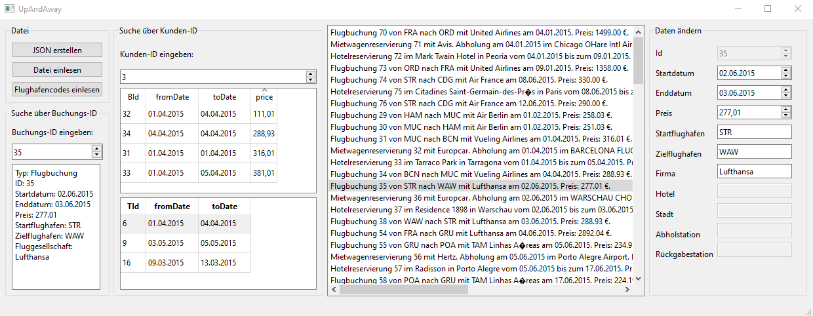

### Beispiel

Einfaches Programm zum einlesen von Buchungen, deren Bearbeitung und Speicherung

## TODO

- [X] Json datei erstellen knopf machen und programmieren

- [X] Attribute verändern und abspeichern

- [X] Price richtig formatieren bei der Liste

- [X] Attribute anzeigen bei ID Suche

- [X] Verhindern das 2 Dateien gleichzeitig eingelesen werden können

# TODO P3

- [X] UI Elemente ordentlich Designen

- [X] Klassendiagramm nachbauen

- [X] UI von der Logik trennen

- [X] Datei einlesen im neuen format

- [X] UI an die Daten anpassen

- [X] Lösung auf gitlab hochladen

# Aufräumarbeiten

- [X] Alle klassen auf QTKlassen umstellen (bspw String auf Qstring) 

- [X] Datum von string auf QDate umstellen und nicht mehr mit dem String arbeiten

# Bugs

- [ ] zu viele Travels

- [ ] oberfläche spinnt rum

- [ ] die neuen Tabellen aktualisieren nicht

- [ ] name fehlt in den daten